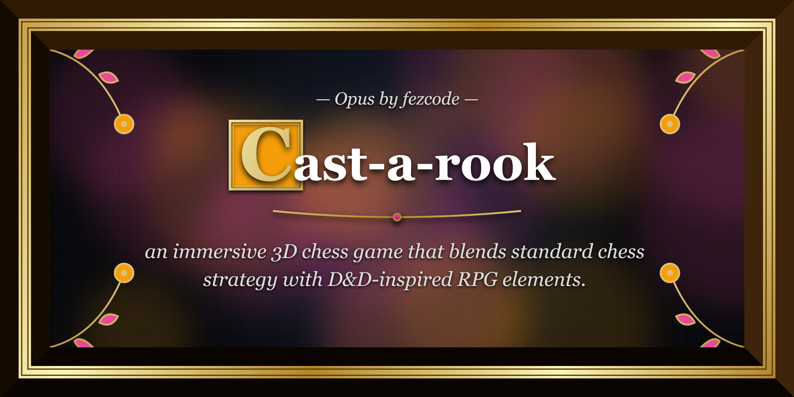

# 👑 CASTAROOK: A Strategic Saga

# [🎮 PLAY CASTAROOK NOW!](https://fezcode.com/g/castarook/)

**Castarook** is an immersive 3D chess game that blends standard chess strategy with D&D-inspired RPG elements. Set in a living, breathing valley featuring dynamic weather, procedural terrain, and a beautiful interface.



## 📜 The Core Mechanics

Unlike regular chess, pieces in this saga don't always perish in a single strike. Every capture attempt initiates a **Battle Phase**.

### 🎲 Combat System & Dice
When one piece attacks another, combat is determined by the fate of the dice.
*   **Piece-Specific Dice:** Each unit rolls a unique die based on its power:
    *   **Pawn:** D6
    *   **Knight:** D10
    *   **Bishop:** D12
    *   **Rook:** D15
    *   **Queen:** D18
    *   **King:** D20
*   **Veteran Attributes (Max +5):** 
    *   **Attacker Total:** `Die Roll + Veteran Kills`
    *   **Defender Total:** `Die Roll + Walls Defended - Penalty`
*   **Opportunity Attack (Vulnerability):** Any unit that has just moved becomes **Vulnerable (-2 Defense)** until the start of its next turn. This rewards aggressive counter-play.
*   **Damage Calculation:** The difference between the two totals is dealt as damage to the loser's health.
*   **Health Points (HP):**
    *   **Pawn:** 10 HP
    *   **Knight / Bishop:** 20 HP
    *   **Rook:** 30 HP
    *   **Queen:** 40 HP
    *   **King:** 15 HP
*   **Survival:** If a unit takes damage but remains above 0 HP, it stays on its square. A capture only occurs when a unit's health is fully depleted.

### 🤖 Singleplayer (Player vs AI)
*   **Greedy AI:** You can challenge a custom-built AI opponent in the main menu. The AI calculates "Expected Value" based on piece values, current HP, and combat probability (accounting for dice sides and stat bonuses) to execute ruthless—though sometimes unpredictable—attacks.

### 👑 Special Rules
*   **Siege Weapons (Onagers):** Each player has a one-time use Onager stationed behind their base.
    *   **Area of Effect:** Attacks the first 4 rows in front of the base (Rows 1-4 for White, 8-5 for Black).
    *   **Damage:** Deals a massive **12-16 DMG** to all units in the targeted zone.
    *   **Strategic Use:** Can clear a crowded board or severely weaken high-HP units, but use it wisely—it's a single-use tactical strike.
*   **Pawn Promotion:** Pawns reaching the far edge are automatically promoted to **Queens**, gaining full HP and range.
*   **Castling:** Perform a strategic swap between your King and Rook if neither has moved and the path is clear.
*   **Victory:** There is no "Checkmate" logic here—you must **execute the enemy King** by depleting his HP to win the campaign.

## 🌲 Immersive Environment

The battlefield is situated in a rich, low-poly procedural world:
*   **The Stone Plaza:** A deep-foundation, tiered stone stage where the battle takes place.
*   **Procedural Scenery:** Varied elevations, including rolling hills, the "Western Mound," the "Eastern Plateau," and a grand Stone Bridge spanning a carving river.
*   **Living World:** Grounded, animated trees, swaying grass, and wandering rabbits react to a global wind system.
*   **Day/Night Cycle:** Toggle between a bright "Sunrise" and a flickering "Twilight" mode featuring firecamps and dynamic lighting.

## 🎨 Aesthetic & UI
*   **Cinematic HUD:** Features gold-etched borders, a "War Chronicles" log, interactive battle pop-ups, and a dynamic Game Mode indicator.
*   **Camera Controls:** Freely observe the board (Left Click = Orbit, Right Click = Pan, Scroll = Zoom, 'R' or Middle Click = Reset View).
*   **3D Animations:** Units perform lunging strikes during combat and physically fall over/sink into the dirt upon death.
*   **Customization:** Change board styles (Wood, Stone, Marble) and customize your army's colors via the Strategic Menu.

## 🚀 Getting Started

### Prerequisites
*   [Node.js](https://nodejs.org/) (v18 or higher recommended)

### Installation
1.  Clone the repository.
2.  Navigate to the client directory:
    ```bash
    cd client
    ```
3.  Install dependencies:
    ```bash
    npm install
    ```
4.  Launch the campaign:
    ```bash
    npm run dev
    ```

## 🛠️ Built With
*   **React** - UI Framework
*   **Three.js** - 3D Engine
*   **React Three Fiber** - React renderer for Three.js
*   **Drei** - Specialized helpers for 3D environments
*   **Vite** - Build Tool

---
Created by Fezcode. Roll for Initiative!